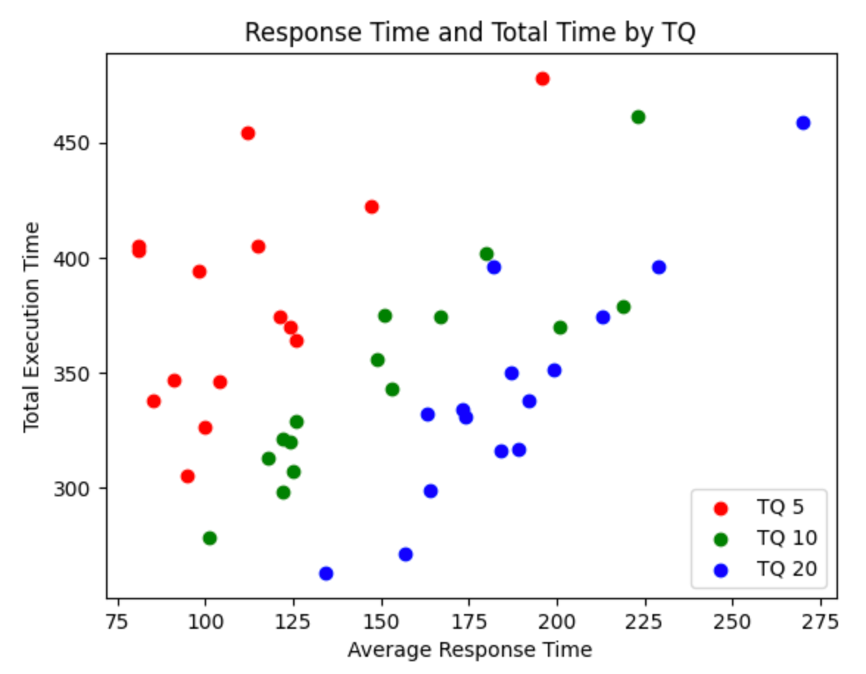

# Operating System Simulator

Shout out to Prof. Ryu

This project earned me the highest grade in my Operating Systems class.

## Term #1 : Round Robin Scheduler

This project aims to simulate the Round-Robin scheduling algorithm, one of the operating system scheduling techniques. To organize a complex process management system, a primary process creates and manages ten child processes, and the parent and child processes exchange messages with each other through an Inter-Process Communication (IPC) message queue. Each child process performs tasks according to a fixed time quantity and can generate IO bursts according to a random probability. When an IO Burst occurs, it immediately leaves the execution state and returns after performing IO operations. The main goal of this project is to implement a Round-Robin scheduler, understand how it works, and analyze the impact of scheduling parameters such as Time Quantum on the efficiency of the scheduler.

### Environments
* C++ 17 or higher
* MacOS (with Linux compatibility)

### Build & Execute
```
g++ -std=c++17 rr_core.cpp -o rr_core // build
./rr_core >> schedule_dump.txt // execute and log
```

### Experiment Result


The higher the time quantum, the longer the average response time.

## Term #2 : Virtual Memory Manager

This project implements an operating system for virtual memory management. One parent process acts as the kernel, and ten child processes act as user processes. Physical memory is partitioned into page sizes, and the operating system maintains a list of available pages. The operating system manages a page table for each process and allocates an empty page table when a new process is created. The user process sends an IPC message with a memory access request for ten pages. The operating system checks the page table, accesses the physical address to see if it is valid, and frees the space by SWAP. It takes a new empty page frame from the list of available pages if it is invalid. The page table is updated with the page frame number. To check if the swap is successful and if the data is being written well, a char[4] size emoji is created and printed to the log. Virtual memory is an essential tool that frees you from the constraints of physical memory size and helps you manage resources more efficiently by minimizing inefficiently used memory areas.

### Environments
* C++ 17 or higher
* MacOS (with Linux compatibility)

### Build & Execute
```
g++ -std=c++17 manager_core.cpp -o manager_core // build
./manager_core >> schedule_dump.txt // execute and log
```

### Experiment Result
|PA Size | 5 | 6 | 7 | 8 | 9 |
|-|-|-|-|-|-|
|ex0|100|91|68|29|34|
|ex1|93|84|89|47|34|
|ex2|97|99|90|50|50|
|ex3|94|86|61|33|31|
|ex4|90|85|91|92|30|
|avg|94.8|89|79.8|50.2|35.8|

The larger the PA size, the smaller the average Page Fault.
Especially in 7->8 enlargement